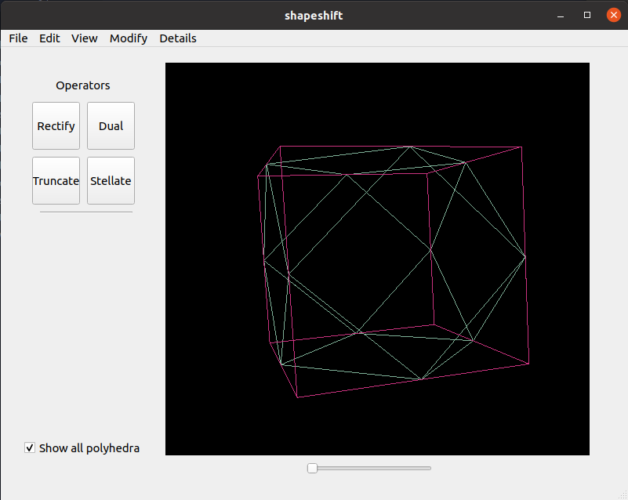

# shapeshift
A GUI application for generating and visualizing polyhedra using geometric operations.

## Premise

Seed polyhedra are provided as the five Platonic solids.
The following operations can be combined in different orders to create new and complex polyhedra:
* [Truncation](https://en.wikipedia.org/wiki/Truncation_(geometry))- creates new faces at each vertex
* [Rectification](https://en.wikipedia.org/wiki/Rectification_(geometry))- constructs new vertices from midpoints
* [Faceting](https://en.wikipedia.org/wiki/Faceting)- keeps vertices but makes new faces from them
* [Reciprocation](https://en.wikipedia.org/wiki/Dual_polyhedron)- converts vertices to faces and vice versa

Shapeshift displays these resulting polyhedra in 3D rotation and provides details on vertices, edges, and faces.

## Dependencies
Shapeshift uses Python3 along with the following packages that can be installed through the Python package manager `pip`:

* `moderngl` for polyhedron visualization
* `numpy` for numerical calculations
* `pyrr` for matrix creation
* `pyside6` for window and widgets
* `sympy` for symbolic notation

The program can then be run by executing `window.py` in a Python3 interpreter.
