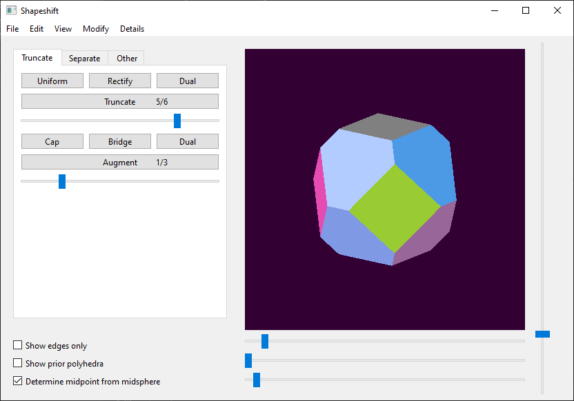

# shapeshift
A GUI application for generating and visualizing polyhedra using geometric operations.

## Premise


Seed polyhedra are provided as the five Platonic solids.
From there, polyhedra can be [truncated](https://en.wikipedia.org/wiki/Truncation_(geometry)) to create new faces at each vertex.

Shapeshift displays these resulting polyhedra in 3D rotation and provides details on vertices, edges, and faces.

## Dependencies
Shapeshift uses Python3 along with the following packages:

* `moderngl` for polyhedron visualization
* `numpy` for numerical calculations
* `pyrr` for matrix creation
* `pyside6` for window and widgets
* `sympy` for symbolic notation

The dependencies and their versions are stored in `requirements.txt`. These can be installed with the following code while in the highest-level package directory:
```
python3 -m pip install -r requirements.txt
```

The GUI itself can then be opened as follows:
```
python3 window.py
```

## Dependency issues
As of 2023/10/28, Python3.12 isn't compatible with all dependencies yet.
Python 3.9 - Python 3.11 appear to work.